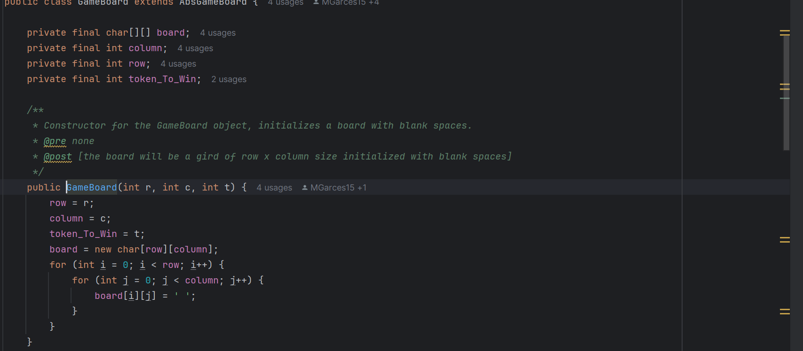
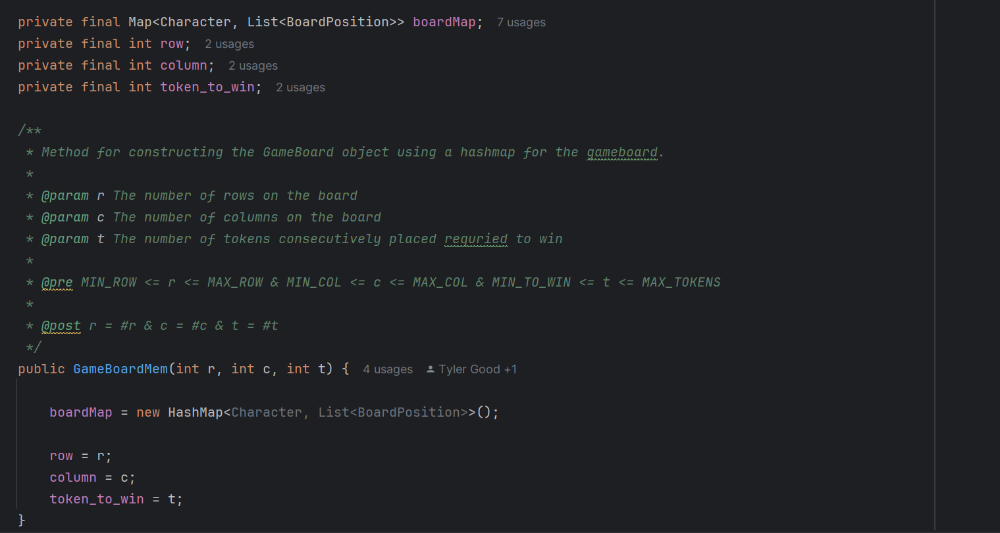

#Software Engineer

### Profile Summary
- Advanced proficiency in software and Linux, Git/Github coding languages such as C/C++, Java, and Python
- Strong understanding of hardware components and computer systems
- Experienced in developing innovative solutions and contributing effectively to projects
- Proficient in working with embedded systems such as arduino
- Software testing experience

### Relavant Coursework
- Algorithms and Data structures - Basics of sorting, searching, and graph algorithms, as well as various data structures. Analyzing algorithm efficiency using time and space complexity. 
  
- Computer Organizations - Fundamental components of computer systems, including CPU architecture and memory organization. Knowledge in assembly language programming, digital logic, and performance optimization.

- Software Development Foundations - Fundamentals and best practices of software engineering. Version control, object-oriented programming, testing, debugging, and designing maintainable code.

- Discrete Structures for Computing - Logic, set theory, graph theory, and proofs.

### Education
Clemson University - Computer Science 2022-2027

### Work Experience
Coding Instructor Intern - Beaufort Digital Corridor 2020-2022
- Designed and developed interactive coding projects (games, apps) to engage students in software development.
- Enhanced communication and leadership skills by mentoring students in group and one-on-one settings.

### Projects
Extended Connect 4
- Worked in a team to design and develop an extended version of the Connect 4 Game that runs with a command-line interface. Unlike the classic Connect 4 game, the game implemented through Java allow users to choose dynamic board sizes, customize the difficulty through changes win requirements, and provides options for more than 2 players. The game also offers both a fast and memory-efficient version to enhance player experience. Adhering to industry-standard tools and practices, the project focused on creating a robust, scalable, and user-friendly version of the classic Connect 4 game. During this project, I contributed to both the development and optimization processes, learning how to write clean, maintainable, and efficient code.

  ## Code Snippets

This first image shows the fast implementation for the connect 4 game. Using a 2D array to display the spaces on the board. Although this method is convenient it isn't memory efficient as spaces are generated even when unoccupied. 

On the contrary this second image uses a hash map to store the spaces and tokens. This method is better for users who don't have a lot of memory. This is because the spaces don't exist until they are occupied by a token and therefore the spaces that remain empty do not take up memory.

### Technical Skills
Tools - Visual Studio, Android Studio, Linux, IntelliJ, Vim, emacs

Technologies - Git/GitHub

Languages - C/C++, Java, Python, x86-64 Assembly
